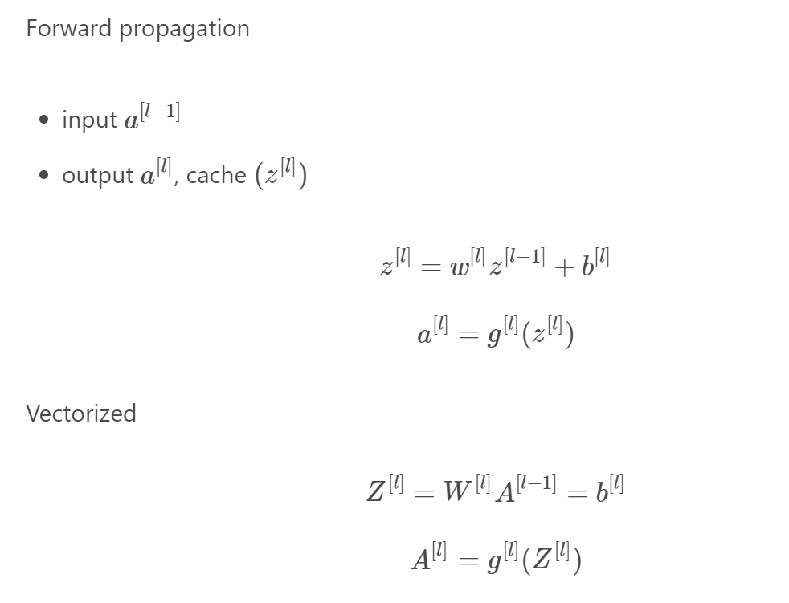
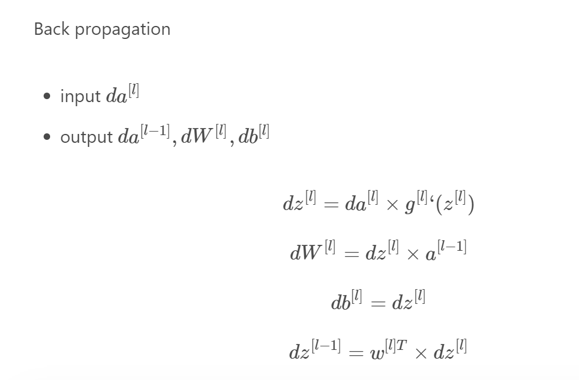

# Deep L-layer neural network


- L to denote the number of layers in a neural network
    - in this neural network `L=4`
- `n^[l]` to denote a number of layers in the lth layer
    - `n^[l]= 4`, there are four units in the first layer
    - `n^[2] = 4`, there are four units in the second layer
    - `n^[3] = 3`, there are three units in the thirs layer
    - `n^[4] = 1`, this neural network outputs a scalar value
    - `n^[l] = n^[x] = 3` because input vector, feature vector, has three features
- `a^[l]=g(z^[l])` to denote activation functions in the lth layer
    - `x=a[0]`
- `W^[l]` to denote weights for computing `z^[l]`
---

# Forward Propagation in a Deep Network


---
# Getting your matrix dimensions right


---
# Building blocks of deep neural networks

### **Forward** pass for layer ***l*** 

we get as we input activations from the previous layer and as the output we get activations of the current layer, layer ***l***.


***Equations for this calculation step are :***

         z[l]=W[l]a[l−1]+b[l]

         a[l]=g(z[l])


### **Backward** pass 

is done as we input **da[l]** and we get the output **da[l−1]**, as presented in the following graph. 


### In the following picture we can see a diagram of both a forward and a backward pass in the layer l.


> - to calulate values in the backward pass we need cached values.
> - Here we just draw z[l] as a cached value, but indeed we will need to cache also W[l] and b[l] as well as a[l−1].


### If we implement these two calculations as presented in a graph above, the computation for an L layer neural network will be as follows:


### A 2-layer neural network is presented in the picture below:


> with input feature vector  x=a[0]

---
# Forward and Backward propagation step equations

## 1) Forward propagation 



## 2) Backward propagation


---
# Parameters vs Hyperparameters

- The parameters of our model are **W[1]**,**b[1]**,**W[2]**,**b[2]**,…

```
Hyperparameters are the variables that determines the network structure and the variables which 
determine how the network will be trained and controls our parameters.
```

- The Hyperparameters of our model are:
    - learning rate **α**
    - number of iterations
    - number of hidden layers L
    - number of hidden units per layer
    - choice of activation function per layer


- Later hyperparameters
    - momentum
    - minibatch size
    - regularizations

### Applied deep learning is a very empirical process.

```
Idea -> Code -> Experiment
<- Repeat <
```

---

# Summary


---
3- Resources ? 
-
- [https://old.alexander-wong.com/post/neural-networks-and-deep-learning-week4/#forward-propagation-in-a-deep-network](https://old.alexander-wong.com/post/neural-networks-and-deep-learning-week4/#forward-propagation-in-a-deep-network)
- [http://datahacker.rs/deep-layer-neural-network/](http://datahacker.rs/deep-layer-neural-network/)
- [https://old.alexander-wong.com/post/neural-networks-and-deep-learning-week4/#forward-propagation-in-a-deep-network](https://old.alexander-wong.com/post/neural-networks-and-deep-learning-week4/#forward-propagation-in-a-deep-network)
